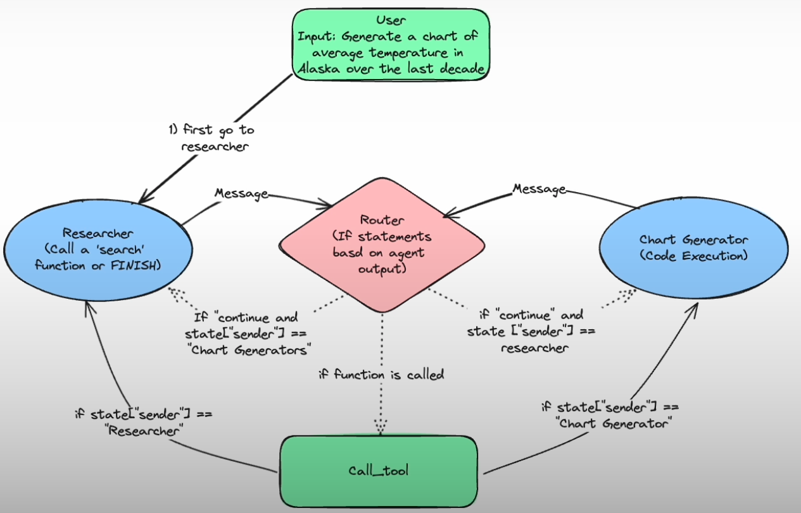

# Essay Writer Using Agent

An AI-powered essay generation tool with a multi-agent workflow, featuring a modern Gradio interface with real-time state management and interactive controls.

## Features

### 🎨 Modern UI
- **Beautiful gradient theme** with blue-to-teal color scheme
- **Emoji-enhanced navigation** for better visual clarity
- **Auto-refresh tabs** - Plan and Research Content automatically update when you navigate to them
- **Larger text areas** (15 lines) for better content visibility
- **Color-coded buttons** with hover effects

### 🤖 Multi-Agent Workflow
- **Plan Generation** - AI creates a structured essay outline
- **Research** - Automated web research using Tavily API
- **Draft Writing** - Generates essay drafts based on plan and research
- **Critique & Revision** - Self-critique and iterative improvement
- **State Management** - Full control over agent state with checkpoints

### 📊 Advanced Features
- **Thread Management** - Multiple concurrent essay generation sessions
- **State Snapshots** - Beautifully formatted history of agent states
- **Live Output** - Real-time monitoring of agent progress
- **Interactive Editing** - Modify plans, drafts, and critiques on the fly

## Getting Started

**1. Clone the repository**
```bash
git clone https://github.com/realsanjeev/Essay-writer-using-Agent.git
cd Essay-writer-using-Agent
```

**2. Set up virtual environment and install dependencies**
```bash
python3 -m venv .venv
source .venv/bin/activate   # On Windows use `.venv\Scripts\activate`
pip install -r requirements.txt
```

**3. Configure API Keys**

Create a `.env` file in the root directory with the following API keys:

```env
OPENAI_API_KEY=sk-....
TAVILY_API_KEY=tvly-....
```

**Note:** The application now supports OpenRouter API for accessing various LLM models. The default model is `openai/gpt-4o` via OpenRouter.

**4. Run the application**
```bash
python app.py
```

The Gradio interface will launch in your browser, typically at `http://127.0.0.1:7860`

## Usage

### Generating an Essay

1. **Enter Topic**: Type your essay topic in the input field
2. **Click "🚀 Generate Essay"**: The agent will start the multi-step process
3. **Monitor Progress**: Watch the live output and status indicators
4. **Navigate Tabs**: View the plan, research, draft, and critique in separate tabs
5. **Edit & Continue**: Modify any component and click "▶️ Continue Essay" to iterate

### UI Tabs

- **Agent** - Main control panel with topic input, status display, and live output
- **📋 Plan** - View and edit the essay outline (auto-refreshes on tab open)
- **🔍 Research Content** - Browse research materials (auto-refreshes on tab open)
- **✍️ Draft** - View and edit the essay draft
- **💭 Critique** - Review AI-generated feedback
- **📸 State Snapshots** - Explore the complete history of agent states

## Multi-Agent Design

### Architecture Benefits

1. **Focused Tools:** Grouping tools by responsibility enhances performance as agents perform better with focused tasks than when choosing from many tools.
2. **Separate Prompts:** Using distinct prompts with specific instructions and examples improves results. Each agent can even use a separate fine-tuned LLM.
3. **Modular Development:** Evaluating and improving each agent individually is easier and doesn't affect the larger application.
4. **Divide and Conquer:** Multi-agent designs break complex problems into manageable tasks, allowing specialized agents and LLM programs to target each unit effectively.

### Agent Connection
The **router** primarily manages state transitions. After each LLM call, it examines the output. If a tool is invoked, it calls that tool. If the LLM responds with "FINAL ANSWER," it returns the response to the user. If neither condition is met, it passes the task to another LLM.



### Technical Stack

- **LangChain** - LLM orchestration framework
- **LangGraph** - Multi-agent workflow management
- **Gradio** - Modern web UI framework
- **OpenRouter** - LLM API gateway (supports multiple models)
- **Tavily** - Web research API

## References

- [LangGraph Documentation](https://blog.langchain.dev/langgraph/)
- [LangGraph: Multi-Agent Workflows](https://blog.langchain.dev/langgraph-multi-agent-workflows/)
- [Adaptive RAG](https://langchain-ai.github.io/langgraph/tutorials/rag/langgraph_adaptive_rag/)
- [CrewAI Documentation](https://docs.crewai.com/core-concepts/Agents/)
- [GPTResearcher Github](https://github.com/assafelovic/gpt-researcher?ref=blog.langchain.dev)

## License

[MIT License](./LICENSE)
